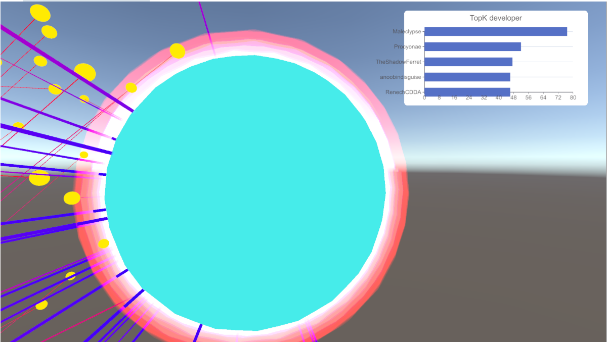

# Open WorldLand

## 第三方依赖

1. XChart：用于图表的管理和创建https://github.com/XCharts-Team/XCharts
2. LiteJson:用于Json读取，直接在Unity插件商店里面下载就好

# 开发日志：

## 2024.09.25

1. 首先是做了一下数据的读入和节点的初始化，因为是测试阶段，所以数据上选择了down下来的关于repo的developernetwork的数据。然后节点分布算法上就首先选择了随机生成位置

2. 说一下遇到的问题：

   > 【问题1】首先是节点信息下载的问题。还需要细化一套流程，我现在构思的流程是这样的：（以Repo为视角）
   >
   > 1. 最开始应该获取的是可以动态获取当前时间节点所有的Repo的id和name。
   > 2. 通过这些repo获取developnetwork
   > 3. 解析developnetwork获得周围user的name和他们之间的连边
   > 4. 通过user的name获得id以及user和openRank

   这一套流程下来的问题是，user和user之间的关系是和repo联系的，彼此之间关联也是靠Repo获得的边维护的。

   需要再思考到底想要什么样子的网络呈现，也就是说，我到底想要什么样子的节点关系排布

   > 【问题2】然后是排布算法的问题，这个比较重要，要在确定好关系排布之后确定下来具体用什么可视化节点排布算法。也许可以借鉴唐学长的毕业论文

3. 下面要做的：

   1. 加个相机控制[√]
   2. 考虑好问题1
   3. 理顺初始化的逻辑
   4. 边的联通关系要搞一下（包括可视化部分）[[√]]
   5. 节点大小，就是如果我是以Repo视角，那么不同类型的大小也要控制。（要有一个自由控制节点大小的方法）[√]
   6. 需要一个可以挂载的Node信息的Component[√]

## 2024.09.26

相机的控制器搞定了

边的画图链接也搞定了

接下来一个重要问题是这样的：就是怎么初始化，应该还是要去研究之前的galaxy的代码

我刚开始的做法是搞了几个repo的name下来，然后就可以挖到这部分repo的develop-net还有repo-net。这里有两个问题

首先，我应该用什么样的方式去处理围绕着repo的user。他们的构造流程就是：repo->user吗，如果这样的话，流程应该是：

> repo->user;然后user应该要维护一个全局的表，用来表示user和user之间的关系，
>
> user->nebour，然后去表里面查，构建关系，这样就能获得user和与他相关的developer的邻居的连边。

其次，我应该如何去处理新挖掘出来的repo，比如我现在最开始有10个repo，但是这10个repo不止和这10个有关，他们可能和10000个都有关系。那这时候我应该怎么去处理新增的这些repo？

> 两个方法：
>
> 1. 我应该最开始就有所有repo 的name。然后初始化的时候，是要挖掘到所有repo的相关信息。
> 2. 我从一个或者一些repo开始，如果和新的repo有关，就去挖掘新的repo的数据。（这样适合展示）

要考虑一下

## 2024.9.27

基本上，就是要把数据先全部下载下来然后再处理建图

否则问题有2：

> 1.数据下载时间太长
>
> 2.数据下载太多

对于详细信息，就要每次都联网下载，但是建图的时候的信息还是要全部下载下来再说。

完成了发光边缘

我决定先做一下我的特色：先做一个视角切换显示详细信息。

## 2.24.9.28

1. 完成了一个简单的点击星球把视角拉过去和再次点击退出的效果（存在一点bug，就是因为有鼠标带动视角转动的效果，所以当退出Detail视角之后，因为鼠标的位置问题，会导致视角被一下子拉过去）

2. 加了一个简单的图表，这里面的数据获取的name和metrixs部分是写死的，所以明天要修改一下节点的命名，然后可以在点击的时候直接拿取

3. 有个Bug，就是在还没有加载出来图表的时候直接退出Detail

接下来要做的：

1. 根据OpenRank值的不同，让repo节点在几个不同的Shader之间切换
2. 连线的逻辑要处理一下，现在还是根据User作为Repo的子节点来连线的。应该还是要根据openDigger返回的社交网络关系来连线
3. 连线的世界效果要处理一下=>加一个切场动画，一边拉近距离，一边切场再次加载进来就是完成了展示，这时候线什么的都没了
4. 随机化的地球生成，代码我会按照这个系列：https://www.bilibili.com/video/BV1ZK411N7Rm/?spm_id_from=333.999.0.0&vd_source=5d4070cc138983fa1babce80b5a31622
5. UI和图表

争取在十一假期之后拿出第一版Demo
