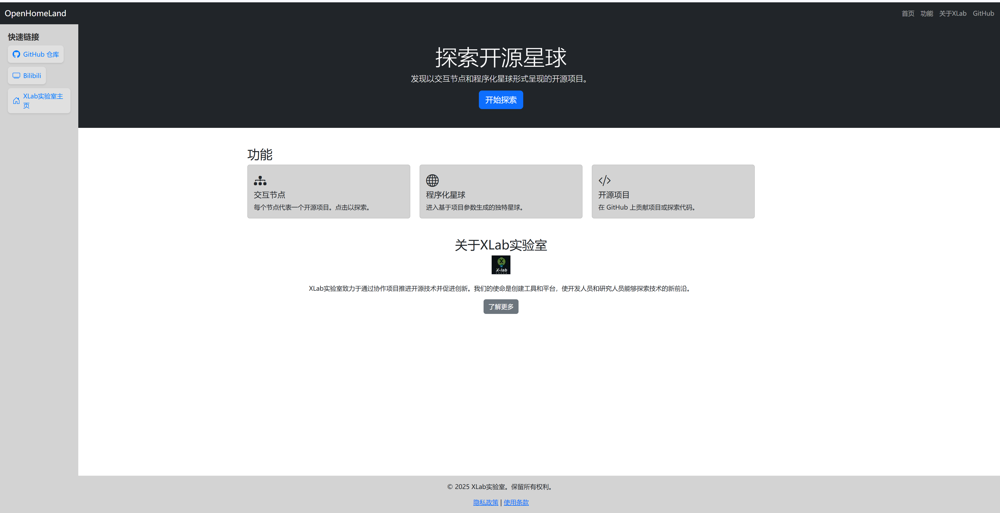

# Open WorldLand

## 第三方依赖

1. XChart：用于图表的管理和创建https://github.com/XCharts-Team/XCharts

2. LiteJson:用于Json读取，直接在Unity插件商店里面下载就好

## 前端部署

项目提供了一个前端部署页面，考虑到包体的大小，因此Build后的包将以压缩包的形式发布，并且也可以自己导出。前端结构如下：

\-- Web

\---- src

\---- unity

\---- index.html

\---- script.js

\---- style.cs 

打包的文件放在unity文件夹下面

```python
python -m http.server 8000
```


## 演示视频

gif:(gif大小比较大，请等待加载)


视频：

[Video](./Readme/perform.mp4)

## PPT

复赛PPT位置在复赛文件夹下

## 开发日志

Log